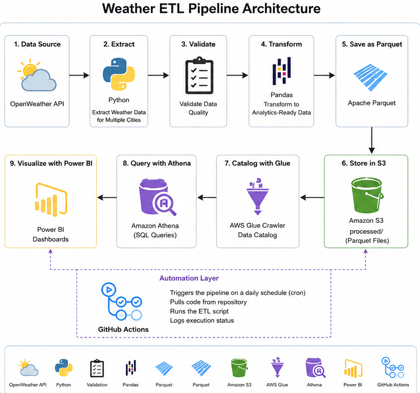

# 🌦️ Weather ETL Pipeline using Python, GitHub Actions, AWS S3, Glue, Athena & Power BI


---

## 📌 Project Overview

This project implements an end-to-end ETL (Extract, Transform, Load) pipeline that collects real-time weather data from the OpenWeather API, validates and transforms the data into an analytics-ready format, stores it in Amazon S3 as Parquet files, catalogs it using AWS Glue, queries it using Amazon Athena, and visualizes insights in Power BI.

The pipeline execution is fully automated using GitHub Actions, eliminating the need for manual execution.

---

# 🚀 Architecture



---

# 📊 Workflow

```
GitHub Actions
        │
        ▼
OpenWeather API
        │
        ▼
Extract Weather Data
        │
        ▼
Validate Data
        │
        ▼
Transform Data
        │
        ▼
Convert to Parquet
        │
        ▼
Amazon S3
        │
        ▼
AWS Glue Crawler
        │
        ▼
Amazon Athena
        │
        ▼
Power BI Dashboard
```

---

# ✨ Features

- Extracts weather data from OpenWeather API
- Supports multiple cities
- Performs data validation
- Converts raw JSON into structured tabular data
- Stores data as highly compressed Parquet files
- Uploads processed files to Amazon S3
- Automatically catalogs data using AWS Glue
- Queries weather data using Amazon Athena
- Automates the ETL pipeline using GitHub Actions
- Interactive Power BI dashboard for visualization

---

# 🛠️ Tech Stack

| Category | Technology |
|-----------|------------|
| Language | Python |
| API | OpenWeather API |
| Data Processing | Pandas |
| File Format | Apache Parquet |
| Cloud Storage | Amazon S3 |
| Data Catalog | AWS Glue |
| Query Engine | Amazon Athena |
| Automation | GitHub Actions |
| Visualization | Power BI |
| AWS SDK | Boto3 |

---

# ⚙️ ETL Pipeline

## 1️⃣ Extract

Weather data is fetched from the OpenWeather API for multiple cities using Python Requests.

Example:

```
GET https://api.openweathermap.org/data/2.5/weather
```

---

## 2️⃣ Validate

The pipeline validates the incoming JSON by checking:

- Required fields
- Missing values
- Invalid records

Only valid records move to the transformation stage.

---

## 3️⃣ Transform

The raw JSON is transformed into an analytics-ready table.

Transformations include:

- Kelvin → Celsius conversion
- Selecting required fields
- Timestamp conversion
- Renaming columns
- Creating a Pandas DataFrame

---

## 4️⃣ Load

The transformed data is:

- Saved locally as Parquet
- Uploaded to Amazon S3

Example bucket structure:

```
weather-etl-kb-2026/

processed/

weather_20260714_135216.parquet
```

---

# ☁️ AWS Services Used

## Amazon S3

Stores processed Parquet files.

---

## AWS Glue

Automatically catalogs Parquet files stored in S3.

---

## Amazon Athena

Runs SQL queries directly on data stored in Amazon S3.

Example:

```sql
SELECT city,
AVG(temperature_c) AS avg_temp
FROM weather_data
GROUP BY city;
```

---

# 🔄 Automation

The ETL pipeline is automatically executed using **GitHub Actions**.

Workflow:

- Checkout repository
- Install dependencies
- Run ETL pipeline
- Upload latest Parquet file to S3

---

# 📈 Power BI Dashboard

Dashboard includes:

- Average Temperature
- Average Humidity
- Average Wind Speed
- Temperature by City
- Humidity by City
- Weather Distribution
- Temperature Trend
- Interactive Filters

---

# 👨‍💻 Author

**Kushagra Bansal**
